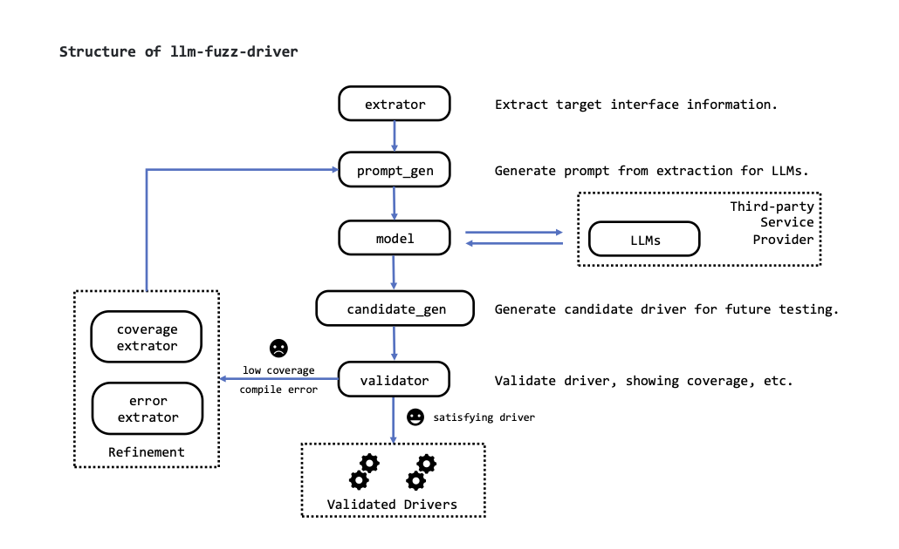

# llm-fuzz-driver
A LLM based fuzz-driver generation tool.

## Overall Structure



## How to Run

Set the configuration in `config.json` file. An example configuration file (for `libxml2/xmllint`) is as follows:

```json
{
    "project_name": "libxml2",
    "target_name": "xmllint",
    "target_function": "main",
    "target_file": "./targets/libxml2-2.13.4/xmllint.c",
    "test_driver_model_code_path": "./prompt_generator/model.c",
    "max_iterations": 10,
    "compile_command": [
        "clang",
        "-g",
        "-fsanitize=fuzzer",
        "-fsanitize=address",
        "-std=c11",
        "-fprofile-instr-generate",
        "-fcoverage-mapping",
        "-o",
        "fuzz_driver",
        "xmllint_fuzz_driver.c",
        "-I./include",
        "./.libs/libxml2.a"
    ]
}

```

The meaning of each field is as follows:

| Field                         | Description                                                        |
|-------------------------------|--------------------------------------------------------------------|
| `project_name`                | The name of the project                                            |
| `target_name`                 | The name of the target                                             |
| `target_function`             | The name of the target function                                    |
| `target_file`                 | The path to the target file (after prebuild)                       |
| `test_driver_model_code_path` | The path to the model code (default: `./prompt_generator/model.c`) |
| `max_iterations`              | The maximum number of iterations                                   |
| `compile_command`             | The compile command                                                |


Then, prepare a prebuild shell script that builds the target and generates the prebuild files. An example prebuild 
shell 
script (for `libxml2/xmllint`) is as follows:

```bash
tar -zxvf libxml2-2.13.4.tar.gz
cd libxml2-2.13.4
./autogen.sh
./configure --disable-shared
make
echo 'libxml2 build done'
```

Then, run the following command:

```bash
python3 main.py <config_file_path> <prebuild_shell_path>
```

## Output Directory Structure

The `outputs` directory is where the generated files are stored. The whole directory is automatically created by the 
tool **on runtime**. The directory structure is as follows:

```
./outputs
    ├── validated_fuzz_drivers
    │   ├── validated_fuzz_driver_1.c
    │   ├── validated_fuzz_driver_2.c
    │   └── ...
    └── temp
        ├── candidate_fuzz_drivers
        │   ├── raw.c
        │   ├── mutant_1.c
        │   ├── mutant_2.c
        │   └── ...
        ├── coverage
        │   ├── raw_coverage.txt
        │   ├── mutant_1_coverage.txt
        │   ├── mutant_2_coverage.txt
        │   └── ...
        └── error_log
            ├── raw_error_log.txt
            ├── mutant_1_error_log.txt
            ├── mutant_2_error_log.txt
            └── ...
```